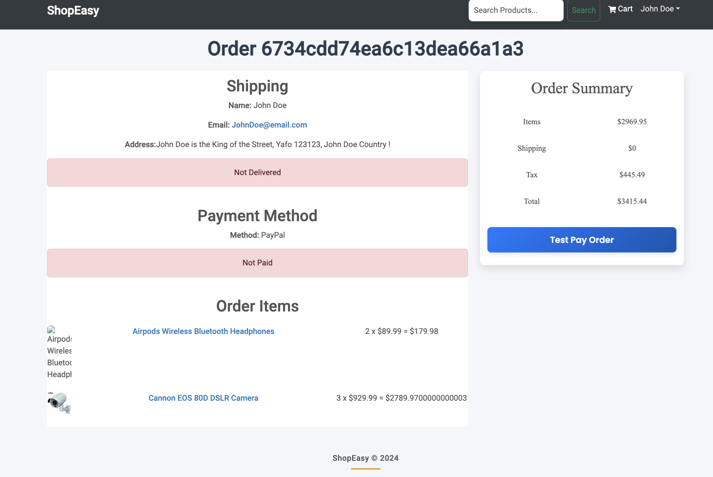

# 🛒 ShopEasy - eCommerce Platform

Welcome to ShopEasy – a custom-built eCommerce platform designed to provide a comprehensive online shopping experience! 🎉

Why go outside when you can ShopEasy from the comfort of your couch? 🛋️ Just sit back, grab a snack 🍿, and let us bring the shopping mall to you! 🛍️


## Screenshots 📸

Below are some screenshots showcasing different features of **ShopEasy** eCommerce platform:

- **Home Page**: Discover trending products and explore various categories.


- **Product Page**: View detailed product information, including ratings and reviews.


- **SignIn Page**: Sign in to access your account.


- **Register Page**: Create an account page.


- **Ordering Page** : John Doe ordering some random products !


- **Shipping Page** : John Doe details 


- **Order Summary Page** : 




- **Admin Page Products** : The Admin can add and delete products


- **Admin Page Users** : The Admin can control all of the users !


- **Admin Page Orders** : The Admin can approve the orders of the users !


## ✨ Features

- 🔒 **Secure JWT Authentication**: Keep your users safe with secure, HTTP-only cookie-based JWT authentication. 🛡️

- 🧙‍♂️ **Admin Area**: Manage customers, products, and orders with ease. Your inner control freak will love it! 🖥️📊

- ⭐ **Product Ratings & Reviews**: Let users leave ratings and reviews to guide future shoppers.

- 🔍 **Product Search, Carousel, Pagination & More**: Quick search, eye-catching product images, easy navigation – we’ve got all the essentials covered! 🔄🖼️


## Installation and Running 🚀

1. **Clone the repository** to your local machine:
   ```bash
   git clone https://github.com/GilMatzafi/shopEasy.git
   cd shopEasy


2. **Install dependencies:**
    ```bash
    npm install

3. **Start the application:**
    ```bash
    npm run dev


## Additional Notes 📌

- This project was developed as part of a **Udemy course** that guided me through the process of building a full-stack eCommerce platform from scratch. The course provided a strong foundation in both **frontend** and **backend** development.
- I gained practical experience with **Express** and **MongoDB**, learning how to structure a backend that efficiently handles data, authentication, and user requests.
- Implementing **JWT Authentication** taught me about secure user sessions and data privacy, key aspects of modern web development.


## Contributions 🤝

Contributions are welcome! If you'd like to improve **ShopEasy** or add new features, please follow these steps:

1. Fork the repository 🍴
2. Create a new branch for your feature or bug fix: `git checkout -b feature-name` 🚀
3. Make your changes and commit them: `git commit -m "Add new feature"` 📝
4. Push to the branch: `git push origin feature-name` 🌐
5. Open a Pull Request 🔄

### Ideas for Contributions

- **CSS Enhancements**: Improve the styling and user interface to make the shopping experience even more appealing. Suggestions include adding animations, refining the layout, and enhancing the color scheme for a polished, modern look.

- **Frontend Features**: Add new features, such as wishlist functionality, product recommendations, or advanced search filters. Improve the user experience by adding smooth transitions or tooltips for better interactivity.

- **Backend Enhancements**: Implement additional backend functionality, such as user activity tracking, inventory management, or order analytics. These additions can make ShopEasy more robust and useful for both users and admins.

- **Improved Admin Tools**: Enhance the admin dashboard with more detailed analytics and reporting, or add a notification system to streamline order and product management.

Feel free to explore these ideas or come up with your own. Every contribution is appreciated, and we’re excited to see how you make **ShopEasy** even better!


